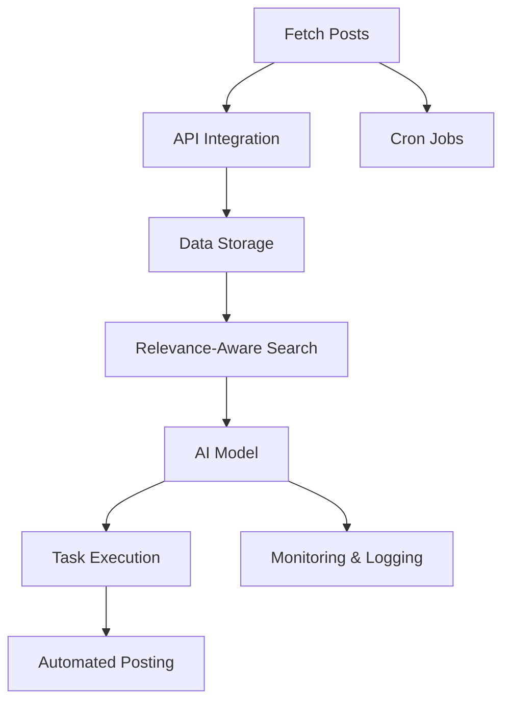
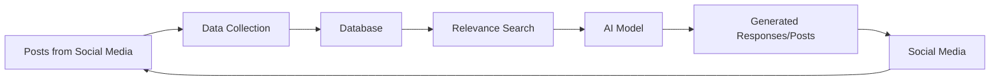
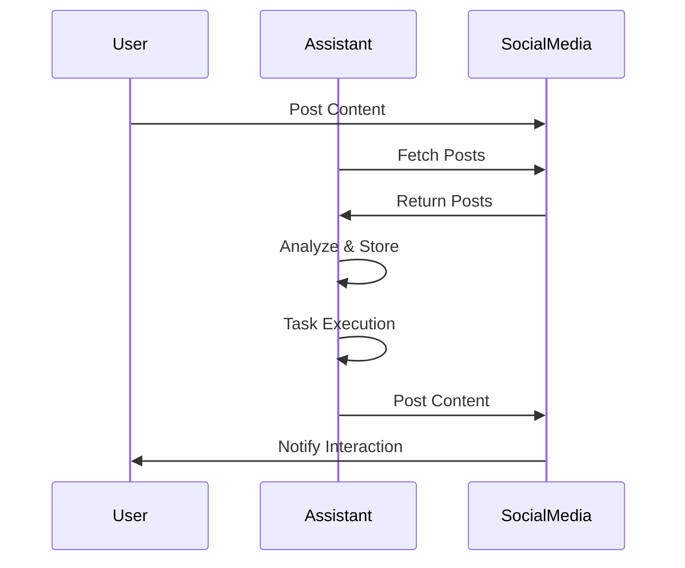
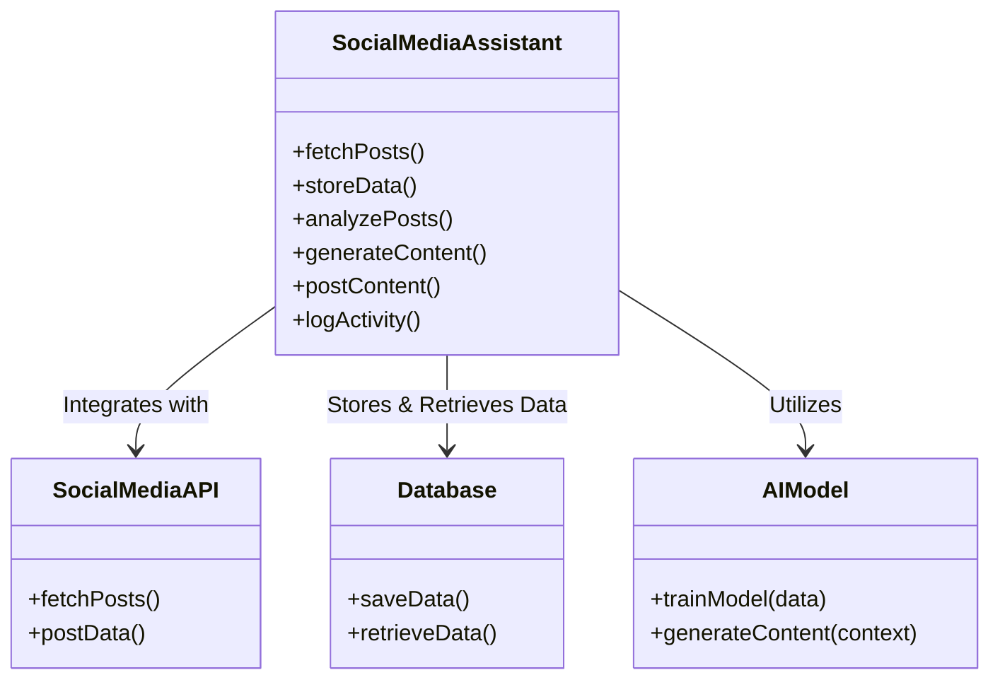

# Lumen - Social Media Assistant

This project is a versatile AI assistant designed to autonomously manage and interact with social media platforms based on user-defined tasks. It can fetch posts, analyze data, generate replies, and create new content, adapting to the specific needs of individuals or organizations.

## Key Features

- **Configurable Tasks:** Easily set up tasks such as posting, replying, or analyzing content to suit different requirements.
- **Scheduled Operations:** Automatically fetches and updates posts on a defined schedule.
- **Intelligent Analysis:** Utilizes relevance-aware searches to generate contextually appropriate responses and content.
- **Personalization:** Customizable to reflect a specific brand, persona, or organizational style.
- **Match Style and Tone:** Fetches the old posts to match the style and tone of the user's previous posts.

## Project Architecture

### 1. Configurable Data Sources

- **Fetch Posts:** Periodically retrieve posts from selected platforms (e.g., Lens API).
- **API Integration:** Employ APIs of various social media platforms for data retrieval and interaction.

### 2. Data Storage

- **Schema Design:** Structures data to store post content, metadata (author, timestamp, tags), and task automation configurations.
- **Relevance Indexing:** Indexes data for efficient search and retrieval based on relevance.

### 3. Task Automation

- **Relevance-Aware Searches:** Implements embeddings and indexing to perform efficient relevance-aware searches for task execution.
- **Content Generation:** AI-driven generation of replies or posts based on specified configurations.

### 4. AI Model

- **Models:** Uses OpenAI Gpt-4o for generating replies and posts, llama3.2 for analyzing the images posted by the user / other posts, Gorq for generating images based on the text for the posts.
- **Context-Aware Responses:** Produces responses or content informed by fetched data and task requirements.

### 5. Platform Interaction

- **Automated Posting:** Engages with platforms through their APIs to post, reply, or interact with content.

### 6. Customizable Configurations

- **Task Definitions:** Allows easy definition of tasks to meet specific needs (e.g., replying, content creation, data analysis).
- **Dynamic Updates:** Supports updating configurations and data sources dynamically without redeploying the application.

### 7. Scheduling

- **Cron Jobs:** Facilitates scheduling of periodic tasks such as data fetching, analysis, and posting.

## Diagrams and Graphs

### Architecture Diagram

### Data Flow Diagram

### Interaction Cycle

### Component Diagram

