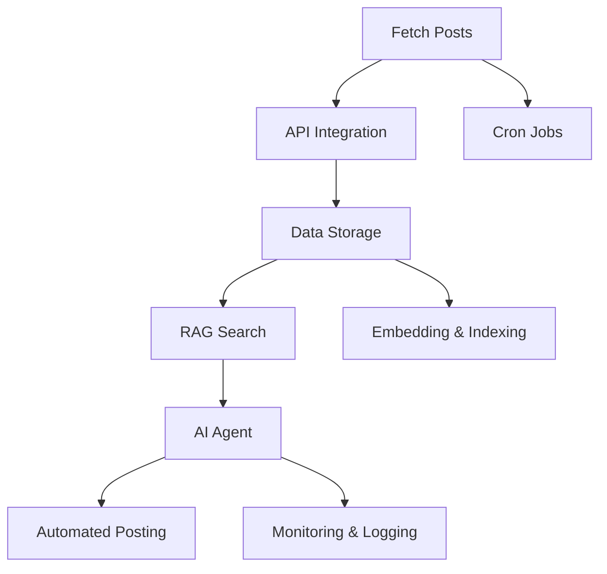
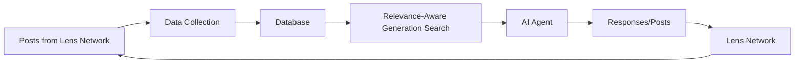
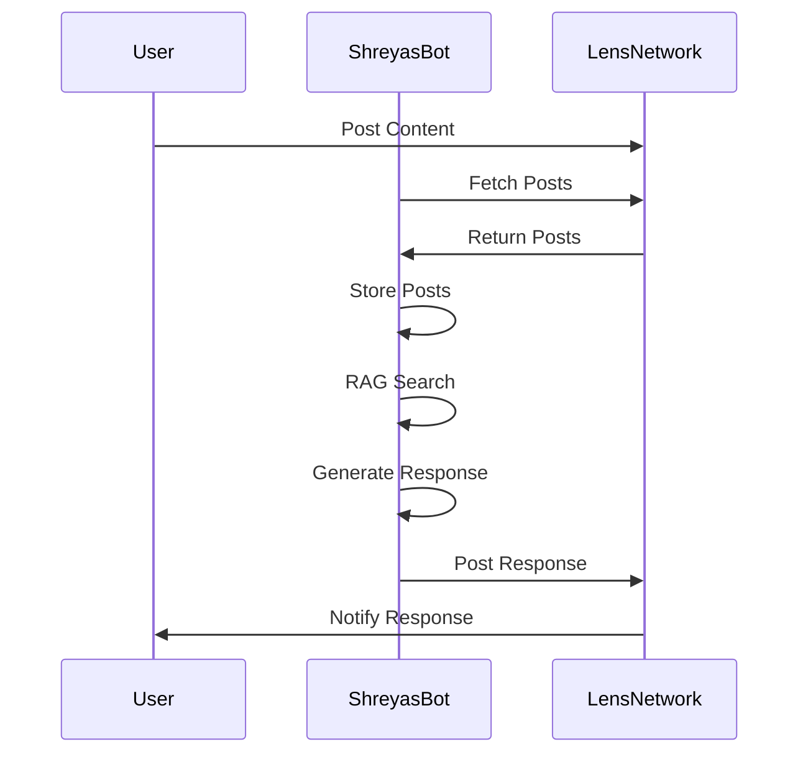
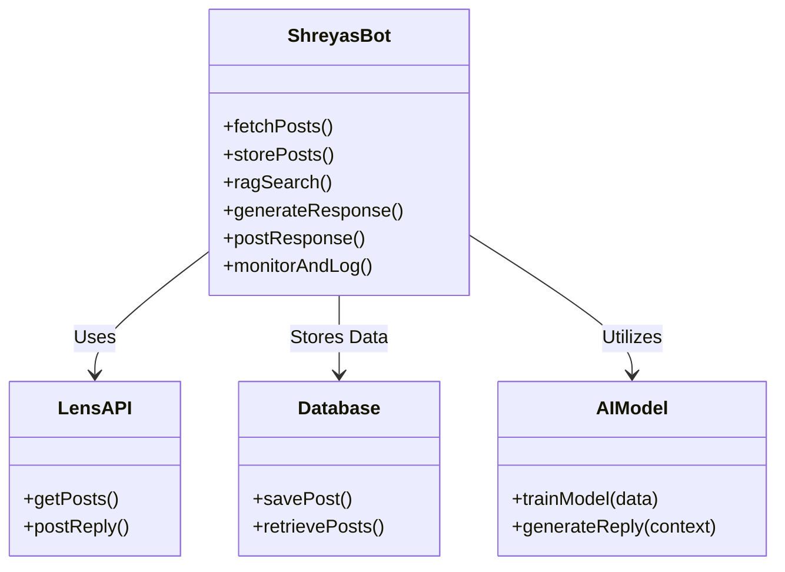

# ShreyasBot  
  
ShreyasBot is an autonomous AI agent designed to manage and interact with the Lens Network on behalf of Shreyas Papinwar. It periodically fetches posts from the Lens Network, stores them, and performs relevance-aware generation (RAG) searches to reply to posts or create new posts. The bot encapsulates Shreyas's personal journey, including his experiences, hackathon wins, college events, travel history, and educational background.  
  
## Key Features  
- **Autonomous Interaction:** Automatically replies to posts or generates new content on the Lens Network.  
- **Periodic Data Fetching:** Periodically fetches posts from the Lens Network.  
- **RAG Search:** Uses relevance-aware generation search to find relevant posts.  
- **Personalized Responses:** Generates responses based on Shreyas's personal data and experiences.  
  
## Project Architecture  
  
### 1. Data Collection  
- **Fetch Posts:** Periodically fetch all the posts from the Lens Network using the Lens API.  
- **API Integration:** Use the [Lens API](https://dev-preview.lens.xyz/docs/getting-started) to gather posts and interactions.  
  
### 2. Data Storage  
- **Database:** Store the fetched posts in a NoSQL (MongoDB).  
- **Data Schema:** Design a schema to store the post content, metadata (author, timestamp, etc.), and related tags for RAG searches.  
  
### 3. Relevance-Aware Generation (RAG) Search  
- **RAG Search:** Implement RAG search to identify relevant posts where the bot can reply or generate new content.  
- **Embedding & Indexing:** Use embeddings to index posts and facilitate quick and accurate search results.  
  
### 4. AI Agent  
- **Model Training:** Train a custom language model fine-tuned on Shreyas's personal data, including his journey, achievements, and experiences.  
- **Response Generation:** The AI agent generates responses or new posts based on the context of the fetched posts and Shreyas's persona.  
  
### 5. Interaction with Lens Network  
- **Automated Posting:** Automate the posting of replies or new content on the Lens Network using the Lens API.  
- **Monitoring & Logging:** Monitor interactions and log activities for transparency and further improvements.  
  
### 6. Periodic Tasks  
- **Cron Jobs:** Set up cron jobs to periodically fetch new posts and perform RAG searches to keep the bot active and updated.  
  
## Diagrams and Graphs  
  
### Architecture Diagram  
  

### Data Flow Diagram

### Interaction Cycle

### Component Diagram

